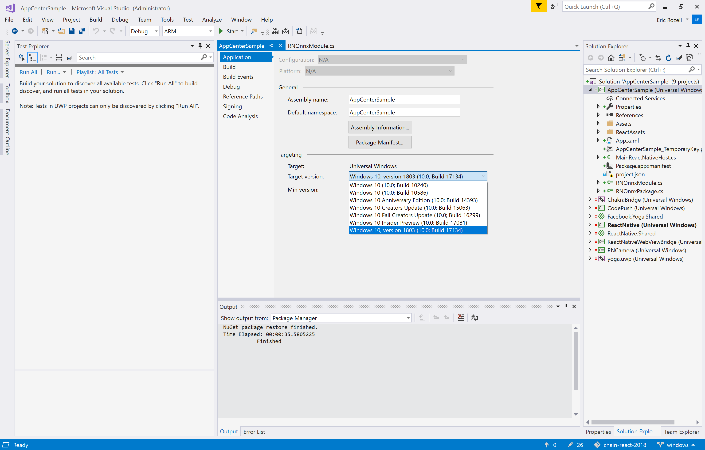

# Lesson 13: Create custom native module for Windows ML

React Native has a rich ecosystem for third-party native modules, but many of these modules are not yet supported on Windows. Fortunately, creating native modules for `react-native-windows` is simple, and has a lot of symmetry with React Native for Android.

## Open the generated UWP project in Visual Studio 2017

Using the Developer Command Prompt for VS 2017, run:
```
devenv windows\<project>.sln
```

## Add required classes for the native module

We'll need to add two classes to our app projects for the native module:
- [`RNOnnxModule.cs`](https://gist.github.com/rozele/9acb6ee6631a3c15918c7deb5afaf166)
- [`RNOnnxPackage.cs`](https://gist.github.com/rozele/639d05321d319be59d8376b760e79794)

## Update the target version for the main UWP app

The React Native CLI `windows` command will generate a project targeting RS1 (10.0.14393.0). In order to use Windows ML features, we need to target RS4 (10.0.17134.0). Right click the main UWP app, select properties and update the target version accordingly:


## Add React package to ReactNativeHost

Update your `MainReactNativeHost.cs` file to include the native React package you just added to the project:
```csharp
        protected override List<IReactPackage> Packages => new List<IReactPackage>
        {
            new MainReactPackage(),
            /* ... */
            new ChainReactWorkshop.RNOnnxPackage(),
        };
```

## Implement the stub image classification module

In Lesson 12, we stubbed out the implementation for the `ImageRecognizer` on Windows. Now that we have a custom native module for image classification, we can fill out this implementation.

```js
import { 
  Image,
  NativeModules 
} from 'react-native';

export default class ImageRecognizer
{
  init;
  labels;

  constructor(options)
  {
    const resolvedModel = (<any>Image).resolveAssetSource(options.model).uri;
    const model = resolvedModel || options.model;
    this.init = NativeModules.RNOnnx.load(model);
    const resolvedLabels = (<any>Image).resolveAssetSource(options.labels).uri;
    this.labels = resolvedLabels || options.labels;
  }

  async recognize(data)
  {
    await this.init;

    return await NativeModules.RNOnnx.evaluate(data, this.labels);
  }
}
```

## _Exit Criteria_
1. `MainReactNativeHost.cs` file includes reference to custom native module package.
2. App still builds and runs successfully with `run-windows` command.

## Lesson 14: React Native Platform Module
[Continue](./14.md)